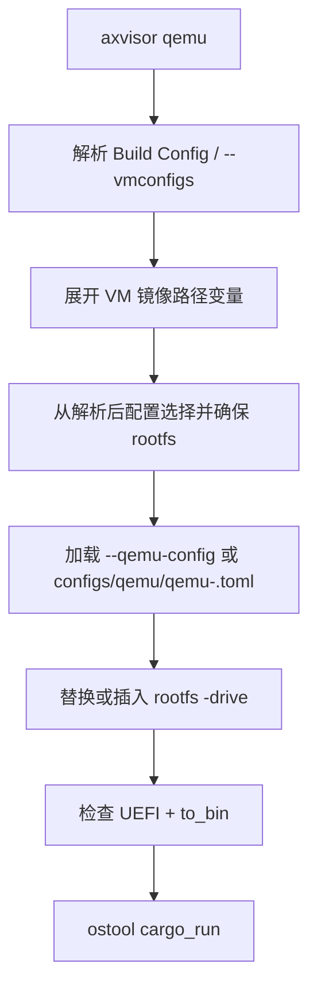

# Axvisor 运行

Axvisor 的 QEMU 流程把 host 启动配置、hypervisor 构建配置、VM 描述和 rootfs 选择分开处理。`axvisor/rootfs.rs` 只补 rootfs drive 和检查 `to_bin`/UEFI 契约；它不会根据架构擅自注入 CPU、firmware 或 guest 启动参数。

## 1. QEMU 启动

Axvisor QEMU 运行先解析 VM 镜像路径，再用同一组配置选择 rootfs，随后读取 host 启动
TOML 并检查产物格式；VM 配置只提供 guest 语义。下图对应 `axvisor/rootfs.rs::qemu()`
的主要步骤。



默认 QEMU 模板位于：

```text
os/axvisor/configs/qemu/qemu-<arch>.toml
```

QEMU TOML 拥有 machine、CPU、accelerator、firmware、device、UEFI 和 `to_bin`。x86 VMX、SVM、UEFI 等场景分别通过对应 test case 的 build/QEMU TOML 表达。

### 1.1 根文件系统

QEMU rootfs 路径的选择顺序为：

1. CLI `--rootfs`，经 image storage 解析后的路径；
2. 第一个 VM config 中 `[kernel].kernel_path` 同目录的现有 `rootfs.img`；
3. 当前 arch 的 managed `rootfs-<arch>-alpine.img`。

显式 rootfs 或 managed rootfs 会在启动前确保可用；若 VM 配置已有 kernel sibling `rootfs.img`，它被视为用例/guest 自己管理的镜像，axbuild 不额外下载默认 rootfs。最终路径由 `patch_qemu_rootfs_path()` 放入 QEMU drive；若模板漏掉 `-drive`，补丁会插入一个 `disk0` raw drive。

### 1.2 启动产物

`build` 默认产出 ELF。QEMU 路径读取实际 TOML 后将 `cargo.to_bin` 设为 `qemu.to_bin`：

- `to_bin = true` 时，运行器为 QEMU 准备 BIN；
- `to_bin = false` 时直接保留 ELF；
- `uefi = true` 且 `to_bin = false` 是明确错误。Axvisor 在启动前报告该错误，要求配置显式设置 `to_bin = true`。

仓库的 Axvisor x86_64 和 loongarch64 默认 QEMU 配置均将 UEFI 和 BIN 选择写在 TOML 中。
guest UEFI firmware 的路径属于 VM config（例如 `boot_protocol = "uefi"` 与
`uefi_firmware_path`）；axbuild 只在构建前展开受支持的路径变量，不改变 guest 固件 ABI。

### 1.3 LVZ QEMU

在 `loongarch64` 上，`AppContext::scoped_qemu_path()` 会为 Cargo/QEMU 调用选择 LVZ QEMU：

1. `AXBUILD_QEMU_SYSTEM_LOONGARCH64` 指定的可执行文件；
2. `AXBUILD_QEMU_DIR` 指定的目录；
3. `$HOME/QEMU-LVZ/build` 或 `$HOME/qemu-lvz/build`；
4. workspace 根及其祖先的 `QEMU-LVZ/build` 或 `qemu-lvz/build`。

找到后临时把目录置于 `PATH` 前端，结束后恢复。其余 QEMU 参数仍由 TOML 给出。

### 1.4 网页管理台

带管理台的运行需要先生成前端产物，再用端口转发把内核的监听地址暴露到宿主机。内核读取 `web-ui/dist`，而 Cargo 不调用 npm，产物缺失时内核构建会直接失败，因此产物构建必须排在二进制构建之前。

```bash
cd os/axvisor/web-ui
npm ci
npm run build
```

产物就绪后，用 `web-ui` 特性内嵌静态资源、用 `browser-console` 启用终端网关，并在 QEMU 配置里加入端口转发。使用 `no-auto-start` 可以让默认客户机停在 `Ready`，便于观察登记表与配置池。

```bash
cargo xtask axvisor qemu \
  -c test-suit/axvisor/normal/qemu-web-ui/build-aarch64-unknown-none-softfloat.toml \
  --qemu-config test-suit/axvisor/normal/qemu-web-ui/web-ui/qemu-aarch64-hostfwd.toml \
  --arch aarch64
```

转发参数由用例目录里的 `web-ui/qemu-aarch64.toml` 派生：把它 `args` 中的网络项换成下面这一对，另存为 `qemu-aarch64-hostfwd.toml`，其余字段保持不变。

```text
-netdev user,id=net0,hostfwd=tcp::8080-:8080 -device virtio-net-pci,netdev=net0
```

启动日志出现下面这行说明监听已就绪，此时浏览器访问 `http://localhost:8080/`。控制面按 local host 信任模型设计，没有鉴权，也不需要填写任何票据。

```text
management HTTP server (axum) listening on 0.0.0.0:8080
```

手工检查覆盖自动化用例之外的部分：根路径返回内嵌页面，`/assets/` 下的资源带不可变缓存策略，未知路径返回 404；`GET /api/vms/pool` 的不可用条目带原因；同一终端通道的第二个订阅者收到 409；`/ws/events` 先发全量快照再发增量帧，而登记表仍以 `GET /api/vms` 为准。

| 现象 | 原因 | 处理 |
| :-- | :-- | :-- |
| 构建报缺少 UI 资产 | `web-ui/dist` 为空或没有生成 | 先执行产物构建步骤再重建 |
| 产物已存在但仍报缺少 UI 资产 | 复用了缺少产物那次生成的资源表，把产物目录整份移走再移回不会改变时间戳 | 删除构建目录下对应的 axvisor 产物目录后重建，或更新产物目录内文件的时间戳 |
| 页面返回 404 但日志显示监听成功 | 该构建没有启用 `web-ui` | 在构建配置里启用该特性 |
| 浏览器无法连接 | QEMU 配置没有 `hostfwd` | 加入端口转发参数 |
| 界面看不到终端面板 | 该构建没有启用 `browser-console` | 启用该特性 |
| 改了前端源码但页面行为没变 | `cargo xtask axvisor build` 只读现成的 `dist`，不调用 npm（见 1.4） | 先 `npm run build`，再重建 Axvisor；只跑 `tsc --noEmit` 或 `npm test` 不更新`dist` |
| 构建进程被杀、失败信息与代码无关 | 内存不足时 OOM killer 静默终止 cargo | 用 `CARGO_BUILD_JOBS=2` 限制并行度 |
| `--qemu-config` 报No such file | 该参数相对**仓库根**，而用例注释里写的是相对用例目录 | 用 `test-suit/axvisor/normal/qemu-web-ui/web-ui/qemu-<arch>-hostfwd.toml` |

这些现象分别落在产物、端口、特性配置和构建环境四类，按处理栏逐项排查即可。

### 1.5 本地演示配置

`test-suit/axvisor/normal/qemu-web-ui/` 下有两类配置，用途不同：

| 配置 | 用途 |
| :-- | :-- |
| `build-<target>.toml` | **测试用例**。命名匹配用例发现规则，会出现在 `cargo xtask axvisor test` 的运行里 |
| `demo-fs-build*.toml` | **本地演示**。命名不匹配发现规则，因此不会出现在任何测试运行中 |

四个演示配置都启用 `web-ui` + `browser-console` + `fs` + `ax-driver/nvme` + `no-auto-start`，并且**故意不带 `vm_configs`**：启动时不注册任何客户机，页面上的每一个客户机都来自操作者放进 `/guest` 的配置。池子递归读取 `/guest` 下所有 `.toml`，而控制台保存的配置也写回 `/guest`。

三个架构各有一份官方 target 的演示配置，riscv64 另开 `sstc` 扩展开关：

```bash
# aarch64
cargo xtask axvisor qemu \
  -c test-suit/axvisor/normal/qemu-web-ui/demo-fs-build.toml \
  --qemu-config test-suit/axvisor/normal/qemu-web-ui/web-ui/qemu-aarch64-hostfwd.toml \
  --arch aarch64

# riscv64
cargo xtask axvisor qemu \
  -c test-suit/axvisor/normal/qemu-web-ui/demo-fs-build-riscv64.toml \
  --qemu-config test-suit/axvisor/normal/qemu-web-ui/web-ui/qemu-riscv64-hostfwd.toml \
  --arch riscv64

# x86_64 —— 见下节的 TODO
cargo xtask axvisor qemu \
  -c test-suit/axvisor/normal/qemu-web-ui/demo-fs-build-x86_64.toml \
  --qemu-config test-suit/axvisor/normal/qemu-web-ui/web-ui/qemu-x86_64-hostfwd.toml \
  --arch x86_64
```

不加 `--rootfs` 时 rootfs 按1.1 的顺序自动获取；已经有一份镜像时用 `--rootfs <path>` 跳过下载。

### 1.6 x86_64 上的网页管理台（TODO）

x86_64 的 Axvisor 本身能在这套流程下正常起来：OVFI 引导、两路 pflash、控制面监听、
Web UI 五个面板、客户机创建与生命周期操作都可用。**缺的是能在可接受时间内启动的客户机。**

实测：同一份 Linux 内核与 initramfs，riscv64 走 Axvisor 约 4 秒进 shell，x86_64 要 140 秒
以上仍在半途，而裸 QEMU 跑同一份只要 0.7 秒——所以不是环境或镜像的问题。

根因是 Axvisor 没有为 x86 客户提供 paravirt 时钟。x86 没有"读时间"这条指令，时间只能从设备
寄存器读，每一次读都 trap 回 hypervisor；客户机因此退回到最慢的 `refined-jiffies` 时钟源，
而它每次 `read()` 都要读一次定时器，于是启动过程的每次时钟读取都成了一次 VM 退出。RISC-V
不受影响，因为它的 `time` CSR 用 `rdtime` 一条普通指令读，不 trap。

待办的修法是实现 kvm-clock——KVM 既有的 paravirt 时钟接口，Linux 原生识别，不需要改客户机。

在这一项完成之前，x86_64 上可以验证控制面、客户机注册表和前端，但**不要把客户机启动耗时
当作 hypervisor 或本次改动的问题**。

## 2. U-Boot 启动

`axvisor uboot` 通过 `--uboot-config` 或 ostool 的配置发现执行 build+run。

## 3. 板卡启动

`axvisor board` 通过 ostool-server 运行；显式 `--board-config` 优先，否则 axbuild 解析当前 Cargo 配置对应的 board run config。它复用 Build Config 的 VM 列表和环境变量。

## 4. 命令示例

以下命令覆盖 aarch64 guest、x86 VMX case 和 LoongArch LVZ 启动三个不同的运行契约。

```bash
# aarch64 QEMU guest
cargo xtask axvisor qemu \
  --vmconfigs os/axvisor/configs/vms/qemu/aarch64/linux-smp1.toml

# x86 UEFI/VMX case 验证宿主启动与宿主 NVMe 文件读写
cargo xtask axvisor test qemu --arch x86_64 --test-case smoke-vmx

# LoongArch LVZ
cargo xtask axvisor qemu --arch loongarch64 \
  --vmconfigs os/axvisor/configs/vms/qemu/loongarch64/linux-rootfs-smp1.toml
```
