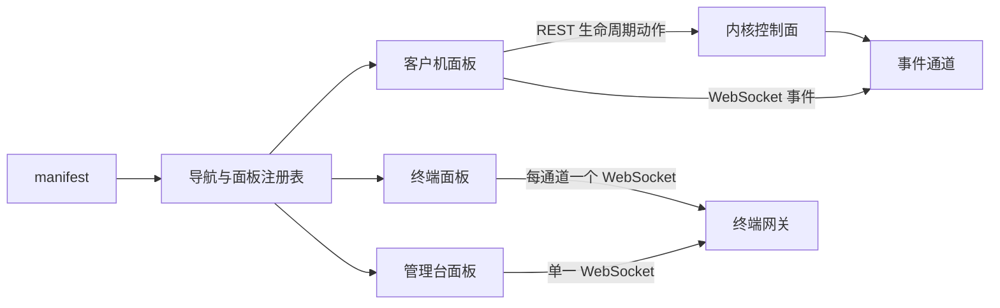

# AxVisor Web 控制台前端

本目录是 AxVisor 浏览器控制台的前端源码，也是它在仓库中的唯一事实来源。控制台按 local host 设计，不涉及鉴权和跨主机安全边界；内核侧只提供数据与控制接口，界面形态、导航结构和面板划分全部由前端决定。

## 1 定位与边界

控制台的目标是把内核已经具备的控制面能力（客户机登记表、配置池、生命周期动作、终端网关）暴露为一个可长期维护的网页界面，而不是再把实验性的单页 HTML 手工拼进内核源码。前端与内核之间只有 HTTP 与 WebSocket 两种通道，构建产物在编译期内嵌进 AxVisor 二进制，运行期不读宿主文件系统。

### 1.1 职责

前端负责以下四件事，且只负责这四件事：

- 读取内核的能力声明，据此生成导航，而不是在代码里写死“有哪些面板”。
- 把客户机登记表、配置池、生命周期动作渲染成可操作的表单与表格。
- 为每条终端通道维护一个 xterm 实例，并把它接到内核的终端网关上。
- 维护一个随事件通道更新的客户机视图，使界面不需要靠轮询猜测内核状态。

### 1.2 明确不做的事

以下内容不属于前端职责，出现在前端即为缺陷：

- 不保存密钥或票据。控制面没有鉴权，前端也不提供任何登录界面。
- 不访问内核之外的地址。所有请求路径都是相对路径，构建产物换一个部署位置仍然可用。
- 不在浏览器里重新实现生命周期规则。能否启动、停止、删除以内核返回的状态与错误码为准，前端只做按钮的可用性提示。
- 不与文件系统直通交互。控制台只发控制请求，不碰客户机文件系统。

## 2 与内核的接口

前端所需的一切都来自内核随构建一起声明的能力表，以及一张固定的端点表。能力表决定“要不要显示这个面板”，端点表决定“这个面板的数据从哪里取”。两者分离之后，新增一个面板只需要在内核侧增加一个声明节点和一个路由，前端不需要新增路径常量之外的改动。

### 2.1 能力声明与导航

启动时前端请求 `GET /api/manifest`，按返回的面板列表生成导航。契约中的 `proto` 是协议版本，`panels` 的每一项描述一个面板的 `kind`、标题和允许的动作。下面的例子对应同时编译了控制面与终端网关的构建。

```json
{
  "proto": 1,
  "panels": [
    { "kind": "vms", "title": "虚拟机", "verbs": ["read", "write"] },
    { "kind": "console", "title": "终端", "verbs": ["read", "write", "stream"] },
    { "kind": "shell", "title": "管理台", "verbs": ["read", "write", "stream"] }
  ]
}
```

`kind` 的取值集合是前端渲染器注册表的键集合的子集。若内核声明了一个前端还不认识的 `kind`，导航仍然显示它，面板区域降级为 JSON 视图；这样内核侧可以先于前端增加能力，而不会把整个界面打坏。

### 2.2 固定端点

端点路径写在前端的 `src/api/` 中，`manifest` 不返回链接。这样做的理由很直接：控制面是同一台机器上的一个固定进程，路径本身是稳定的，把链接放进能力声明只会让两端都要维护同一份信息。

| 端点 | 方法 | 用途 |
| --- | --- | --- |
| `/api/vms` | GET | 客户机登记表，含状态、CPU 数、内存大小 |
| `/api/vms/{id}` | GET | 单个客户机的详细状态，含 vCPU 状态与客户机进入次数 |
| `/api/vms/create` | POST | 按提交的 TOML 创建并登记一台客户机 |
| `/api/vms/{id}/start`、`stop`、`pause`、`resume` | POST | 生命周期动作，返回动作后的状态 |
| `/api/vms/{id}` | DELETE | 关闭并删除客户机，释放其终端通道 |
| `/api/vms/pool` | GET | 配置池目录中的可启动配置，以及不可用配置的原因 |
| `/api/consoles` | GET | 当前有效终端通道的列表，每项含路由名与显示名 |
| `/api/manifest` | GET | 能力声明 |

配置池端点的返回结构承载了“哪些配置暂时不能启动”这一信息，前端把它显示为不可用条目而不是静默丢弃，因为绕过内核去猜测失败原因只会让用户拿到更差的提示。

### 2.3 终端与事件通道

终端与事件是两条独立的 WebSocket 通道，前者传字节流，后者传结构化状态变化。终端通道既承载客户机通道也承载管理台自身的通道，两者用同一套帧语义，因此前端只需要一个终端组件。



终端通道的帧语义是“二进制帧即输出，文本帧与二进制帧都可作为输入”。连接建立时内核先发一帧欢迎信息，前端把收到的所有帧都当作终端输出；因此前端不区分欢迎帧与后续输出，也不需要为首次输入做特殊处理。

事件通道在连接建立后先发一帧全量快照，随后只发增量帧。前端据此维护一份以客户机 id 为键的视图，并在收到增量帧时更新它。登记表本身仍以 `GET /api/vms` 为权威，事件通道只用于避免不必要的轮询和让界面动作及时反映到多个页面。

## 3 目录结构

源码按“外壳、面板、接口、基础库”四层组织。外壳不知道任何面板的存在，面板之间互不引用，两者只通过注册表和请求客户端连接，这样任何一个面板都可以单独删除而不影响其余部分。

### 3.1 外壳与面板的分工

下面三层的职责边界是判断一次改动该落在哪里的依据。

- `src/shell/` 是外壳：读取能力声明、生成导航、承载面板区域与标签页。它不 import 任何面板实现，只从注册表按 `kind` 取组件。
- `src/panels/` 是面板：每个 `kind` 一个目录，目录内聚数据获取与渲染。面板之间不互相 import。
- `src/api/` 是接口层：请求客户端、事件通道、终端通道、契约类型。类型与错误文案集中在这里，避免各面板各写一份。
- `src/lib/` 与 `src/components/` 是基础库：状态到文案的映射、生命周期动作规则、终端组件与通用界面组件。

### 3.2 关键不变量

以下不变量在评审中作为硬性要求，破坏其中任何一条都应被要求修改：

- 外壳目录不出现任何面板 `kind` 的字面量。
- 面板不互相 import，共享逻辑下沉到 `lib/`。
- 请求路径是相对路径，且集中定义，不散落在组件内部。
- 状态到可执行动作的判断只有一处实现，并由单元测试覆盖。
- 代码注释与标识符使用英文，界面文案使用中文。

## 4 构建与调试

前端构建独立于 Cargo：Cargo 只读取构建产物，不调用 npm。这样做的代价是构建二进制之前必须先生成产物，收益是内核构建过程不依赖网络与包管理器，也不会因为 npm 的解析行为变化而随机失败。

### 4.1 构建产物

生成产物使用下面两条命令，产物目录是 `dist/`。Cargo 在开启 `web-ui` 特性时把它整表内嵌进二进制；产物缺失或为空时，构建会以一条指明该命令的错误终止，而不是让二进制在没有界面的状态下静默构建成功。

```bash
cd os/axvisor/web-ui
npm ci
npm run build
```

`dist/` 与 `node_modules/` 都不入库。产物带内容哈希，内核以 `immutable` 缓存策略与精确的内容类型提供它们，因此同一次构建内文件不会被替换，路径也不会被复用。

### 4.2 本地联调

开发时用开发服务器直连目标内核，浏览器访问开发服务器端口即可，同源问题由代理解决。此时前端仍使用相对路径，代理只负责把 `/api` 与 `/ws` 转发到内核的监听地址。

```bash
cd os/axvisor/web-ui
npm run dev     # 5173 端口，/api 与 /ws 代理到 8080
```

改完后端契约时先跑类型检查和单元测试，它们不进内核、也不需要 QEMU：

```bash
npm run typecheck
npm test
```

## 5 测试与持续集成

界面是否真的被内核提供、契约是否与后端一致，不能靠前端自己的单元测试证明，必须有一次真实启动来验证。这条验证由 QEMU 用例完成，它既检查静态资源与响应头，也检查能力声明、终端通道和生命周期动作。

### 5.1 QEMU 用例

用例位于测试套件的 `qemu-web-ui` 目录，构建配置开启 `web-ui` 与 `browser-console`，探针在宿主机上通过端口转发访问运行中的 AxVisor，逐条断言页面外壳、哈希资源与响应头、未知路径的 404、界面实际调用的端点集合，以及终端通道和事件帧。用例同时会驱动一次真实的客户机启动与关闭，以证明界面依赖的动作确实可用。

只跑这一条用例：

```bash
cargo xtask axvisor test qemu --arch aarch64 --test-case web-ui
```

### 5.2 持续集成

持续集成在构建该用例之前准备 Node 环境并生成产物：若运行器上不存在 Node 24，就下载一份固定版本到临时目录并加入 `PATH`，随后执行 `npm ci` 与 `npm run build`。这样做的原因是自托管运行器不保证预装 npm，而把产物入库会让仓库里同时存在源码与可变产物两份事实来源。
